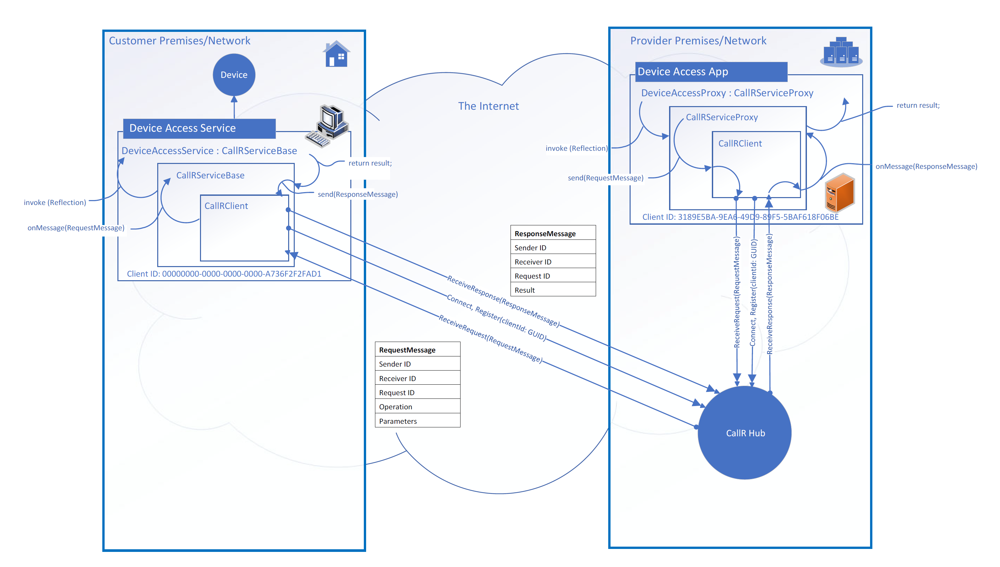

# CallR (Java)
## Overview
CallR is an open-source, object-oriented RPC library and framework that allows implementing and using (calling) services running behind routers and firewals.
It frees you, your organization and customers from the need of configuring any port forwardings on the routers, firewalls, setting up VPNs etc.
## How it Works (The 'Passive Service' Pattern)
These so called 'passive services' run on the protected internal network of the customer and instead of listening for inbound connetions on specific port, they do a secure outbuond HTTPS (Secure WebSocket) connection to a publicly available CallR Hub.
Of course securely, over SSL, employing Authentication and Authorization. On the other side CallR Clients also connect to the hub in the same manner.
After that, the clients can invoke the service by sending an addressed request message to the hub. The hub pushes the request message to the respective service through the WebSocket connection.
In the service, the request message is unwrapped into a method call (using reflection) and the result (or any exception thrown) is obtained. The result then is wrapped into a response message and sent back to the hub.
The hub forwards the response message back to the calling client, where it is unwrapped as a result and returned to the calling method (or the exception is thrown). 

## Common Example Usage and Scenarios
For an example, imagine you are a SAAS provider, who is providing business software solutions for customers in some branch/industry. You are running a web application in your premises (or in your cloud infrastructure), exposed to your customers where they interact with your software. The customer has a device on their premises that has a digital interface to access the device - read/write data, control the device, manage the device settings etc. The device could be any kind of device - a digital scale, dimensioning device, temperature controller etc. The digital interface of the device also could be of any kind - USB, Serial Interface, Network Protocol, Web Service etc. The customer wants you to integrate the device in your software solution. You need to develop and deploy a service, that will run in the customer network/premises. The service  will talk with the device from one side, and will expose an access API to your software from another. 

The **ordinary solution** would be to develop an ordinary service that will listen for connections and requests on some TCP/IP port.

Good. However, next you and your customer would need to configure their network in order for this service to be accessible from the outside - opening ports in firewalls, port forwarding on the routers, setting up VPNs etc. In addition, except with VPNs, you will need to secure the communication with this service (deploy SSL certificates), implement Authentication mechanisms, and so forth. And this for every one of your customers an every one device the might have.

The **callr (passive service) solution** frees you from all this burden. 

## Implementing CallR Services and Clients
In this section we'll go through what is required in order to implement CallR services and clients.
Because all the machinery outlined in previous section is implemented in two base classes - `CallRServiceBase` and `CallRServiceProxy`,
all you need is to inherit from these classes and implement your service/client interface.
For an example we'll go with a very simple `Calculator` service, which can add two integers and return the result.
A more extended example, including hosting the service and client can be found under `examples/calculator` folder of the project
### 1. Define an Interface
The first step in the implementation of CallR service and client is to define an interface, which both the service and client will implement. This guarantees compile-time check of the implementation. For example:
```
public interface Calculator {
	int add(Integer a, Integer b);
}
```
### 2. Implement the Service
To implement the service, all you need is to inherit from `CallRServiceBase` and implement the interface defined in (1).
```
public class CalculatorService extends CallRServiceBase implements Calculator {

	public CalculatorService(CallRClient client) {
		super(client);
	}

	@Override
	public int add(Integer a, Integer b) {
		return a + b;
	}
}
```
That's it. All the required functionaity for connecting to the hub, registering the service (as a client of the hub),
receiving the pushed request messages, unwrapping them and calling the respective method is implemented in `CallRServiceBase` and `CallRClient`.
Note the `CallRClient`is passed as a constructor parameter, but you can use any dependency injection method to inject it from the outside as a bean.
### 3. Implement the Client
To implement the client, all you need is to inherit from `CallRServiceProxy` and implement the interface by simply calling the `invoke()` method of the base class, passing any parameters you might have.
```
public class CalculatorServiceProxy extends CallRServiceProxy implements Calculator {

	public CalculatorServiceProxy(CallRClient client, UUID serviceId) {
		super(serviceId, client);
	}

	@Override
	public int add(Integer a, Integer b) {
		return (int)invoke(
				new Parameter("a", Integer.class.getName(), a),
				new Parameter("b", Integer.class.getName(), b)
		);
	}

}
```
## Hosting
The hub, services and clients are (must be) hosted in a Spring Boot applicaions. The hub must be hosted in a Spring Boot Web application, while services and clients can be hosted in any kind of web/non-web application.

### Hosting the Hub
The hub is hosted in a web application and has requirements for the configuration of SSL, Authentication and Authorization. Because of this it is recommended to host the hub alone in that web application.

### Hosting the Service

### Hosting the Client

## Security

### SSL
For the hub, SSL is configured in the hosting web application at server level. For example in an application.yml file:
```
server:
  port: 8443
  ssl:
    enabled: true
    key-store-type: JKS
    key-store: classpath:keystore.jks
    key-alias: hub.example.com
    key-store-password: s3cr3t
```
You need to import the server SSL certificate in the keystore.
### Authentication

### Authorization

## Consultancy, Development, Integration and Support
 I provide consultancy, end-to-end service/client development, integration (including the hub infrastructure), deployment and support.
 If you are interested in hiring me, please, send me an email message to [vlado@granitsky.net](mailto:vlado@granitsky.net) and we can start discussing your needs.
## Donations
|Please, donate any amount to help the development and support of this project. Thank you!|
|:----:|
|[](https://www.paypal.com/cgi-bin/webscr?cmd=_s-xclick&hosted_button_id=UHUNBVSX2BKVL)|
