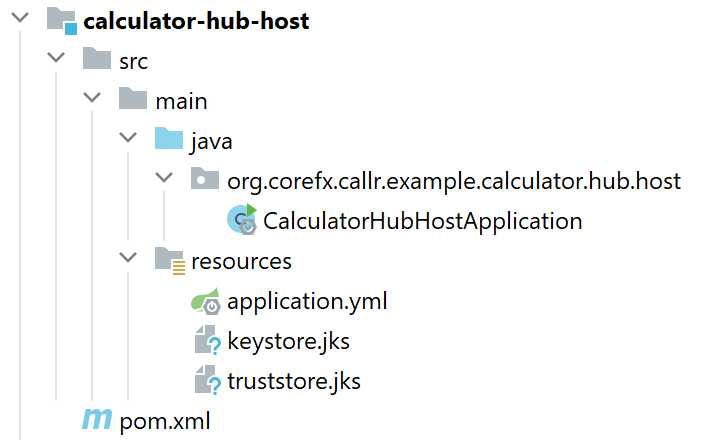

# CallR (Java)
## Overview
CallR is an open-source, object-oriented RPC library and framework that allows you to easily implement and employ services that work seamlesly behind routers and firewals.
It frees you, your organization and customers from the need of configuring any port forwardings on the routers, firewalls, setting up VPNs etc.
## How it Works (The 'Passive Service' Pattern)
A ***CallR Service (the service)***, acts as so called '***passive service***'. It runs inside the protected internal network of your customer and instead of listening for inbound connetions on some specific port, it does a secure outbuond HTTPS (Secure WebSocket) connection to a well-known, available ***CallR Hub (the hub)*** running in your network/premises/cloud. That is ***the service acts as a client of the hub***.
The connection and further communication is of course secure, over SSL, employing Authentication and Authorization.

On the other side ***CallR Service Client (the client)*** also connects to the hub in the same manner.


After that, the client can invoke the service by sending to the hub a request message addressed to the service. The hub pushes the request message to the respective service through the WebSocket connection.
In the service, the request message is unwrapped into a method call (using reflection) and the result (or any exception thrown) is obtained. The result then is wrapped into a response message, which is sent back to the hub.
The hub pushes the response message back to the calling client, where it is unwrapped as a result (or exception), which is returned to the calling method (or the exception is thrown). 
### The Hub Network. Addressing
All the nodes connected to the hub (being services or clients) form the so called '***hub network***'. Inside the hub network these nodes are identified and addressed by their ID (an UUID). Immediatelly after connecting to the hub, the node registers it's ID to the hub and the hub maps the connection ID to the ID of the node. This way the IP addresses of the nodes do not matter. Even if the connection drops and then reconnects, the node changes it's location, IP address etc. , once connected the node will have the same address (ID) inside the hub network and will remain addressable and reachable.

 So, if a client wants to call a service it must know and use the node ID of the service inside the hub network. The node ID of a service must be permanent as it must be well-known to the clients. The node ID of the client can be basically any (random) UUID, but it is recommended to configure it as permanent, because by default it is used in the authentication and authorization mechanisms as an User ID. Otherwise you'll need to define a separate User ID for the client.
### Common Hub Network Infrastructure Diagram

## Common Example Usage and Scenarios
For an example (referring to the above diagram), imagine you are a SAAS provider (on the right), who is providing business software solutions for customers in some branch/industry. You are running a web application in your premises (or in your cloud infrastructure), exposed to your customers where they interact with your software. The customer (on the left) has a device in their premises that has a digital interface to access the device - *read/write data, control the device, manage the device settings etc.* The device could be any kind of device - *a digital scale, dimensioning device, temperature controller etc.* The digital interface of the device also could be of any kind - *USB, Serial Interface, Network Protocol, Web Service etc.* The customer wants you to integrate the device in your software solution. You need to develop and deploy a service, that will run in the customer network/premises. The service will talk with the device from one side, and will expose an API to your software from another.

The ***ordinary solution*** would be to develop an ordinary service that will listen for connections and requests on some TCP/IP port.

Good. However, next you and your customer would need to configure their network in order for this service to be accessible from the outside - opening ports in firewalls, port forwarding on the routers, setting up VPNs etc. In addition, you will need to secure the communication with this service - configure SSL, implement Authentication and Authorization mechanisms, and so forth. And this for every one of your customers and every one device they might have.

Furthermore, over the time, the network configuration at the customer's site could change, the device could be moved to another location, conneted to another PC, the IP addresses could change etc. This would require you and your customer to re-configure the whole service access setup.

The ***CallR (passive service) solution*** frees you from all this burden. All it needs is an outbound connection to the Internet.

## Implementing CallR Services and Clients
In this section we'll go through what is required in order to implement CallR services and clients.
Because all the machinery outlined in the 'How it Works' section is implemented in two base classes - [`CallRServiceBase`](callr-client/src/main/java/org/corefx/callr/client/CallRServiceBase.java) and [`CallRServiceProxy`](callr-client/src/main/java/org/corefx/callr/client/CallRServiceProxy.java),
all you need is to inherit from these classes and implement your service interface.
For an example we'll go with a very simple `Calculator` service, which can add two integers and return the result.
A more extended example, including hosting the service and client can be found under [`examples/calculator`](examples/calculator) folder of the project
### 1. Define an Interface
The first step in the implementation of CallR service and client is to define an interface, which both the service and client will implement. This guarantees compile-time check of the implementation. For example:
```
public interface Calculator {
	int add(Integer a, Integer b);
}
```
### 2. Implement the Service
To implement the service, all you need is to inherit from [`CallRServiceBase`](callr-client/src/main/java/org/corefx/callr/client/CallRServiceBase.java) and implement the interface defined in (1).
```
public class CalculatorService extends CallRServiceBase implements Calculator {

	public CalculatorService(CallRClient client) {
		super(client);
	}

	@Override
	public int add(Integer a, Integer b) {
		return a + b;
	}
}
```
That's it. All the required functionaity for connecting to the hub, registering the service (as a client of the hub),
receiving the pushed request messages, unwrapping them and calling the respective method is implemented in [`CallRServiceBase`](callr-client/src/main/java/org/corefx/callr/client/CallRServiceBase.java) and [`CallRClient`](callr-client/src/main/java/org/corefx/callr/client/CallRClient.java).
Note the [`CallRClient`](callr-client/src/main/java/org/corefx/callr/client/CallRClient.java)is passed as a constructor parameter, but you can use any dependency injection method to inject it from the outside as a bean.
### 3. Implement the Client
To implement the client, all you need is to inherit from [`CallRServiceProxy`](callr-client/src/main/java/org/corefx/callr/client/CallRServiceProxy.java) and implement the interface by simply calling the `invoke()` method of the base class, passing any parameters you might have.
```
public class CalculatorServiceProxy extends CallRServiceProxy implements Calculator {

	public CalculatorServiceProxy(CallRClient client, UUID serviceId) {
		super(serviceId, client);
	}

	@Override
	public int add(Integer a, Integer b) {
		return (int)invoke(
				new Parameter("a", Integer.class.getName(), a),
				new Parameter("b", Integer.class.getName(), b)
		);
	}

}
```
## Hosting
The hub, services and clients are (must be) hosted in a Spring Boot applicaions. The hub must be hosted in a Spring Boot Web application, while services and clients can be hosted in any kind of web/non-web application.

### Hosting the Hub
To host the hub you need a very simple Spring Boot Web Application. The hub has requirements for the configuration of SSL, Authentication and Authorization. Because of this it is recommended to host the hub standalone in that web application. For our example Calculator system, the hub hosting application looks like this:



```
package org.corefx.callr.example.calculator.hub.host;

import org.springframework.boot.SpringApplication;
import org.springframework.boot.autoconfigure.SpringBootApplication;

@SpringBootApplication(scanBasePackages = {
		"org.corefx.callr.hub"
})
public class CalculatorHubHostApplication {

	public static void main(String[] args) {
		SpringApplication.run(CalculatorHubHostApplication.class, args);
	}

}
```
The [```application.ylm```](examples/calculator/callr-example-calculator-hub-host/src/main/resources/application.yml) file contains the configuration for the server, web application and hub. For example:
```yml
spring:
  main:
    banner-mode: off

server:
  port: 9443
  ssl:
    enabled: true
    key-store-type: JKS
    key-store: classpath:keystore.jks
    key-alias: localhost
    key-store-password: s3cr3t
    trust-store-type: JKS
    trust-store: classpath:truststore.jks
    trust-store-password: s3cr3t
    client-auth: need
callr:
  protocol: wss
  host: localhost
  port: 9443
  path: /
  uri: ${callr.protocol}://${callr.host}:${callr.port}${callr.path}

  authentication:
    type: ssl # basic, key, ssl, jwt...
    key:
      header: x-auth-secret
      secret: A6491B50-AF73-4C47-93C0-9E6AED6278DC
    basic:
      secret: A6491B50-AF73-4C47-93C0-9E6AED6278DC
  authorization:
    user-roles:
      00000000-0000-0000-0000-A736F2F2FAD2:
      00000000-0000-0000-0000-A736F2F2FAD3:
        - adder
      00000000-0000-0000-0000-A736F2F2FAD4:
        - adder
        - divider
logging:
  level:
    root: info
    org.corefx.callr: debug

```


### Hosting the Service

### Hosting the Client

## Security

### Transport Layer Securityy (SSL)
For the hub, SSL is configured in the hosting web application at server level. For example in an application.yml file:
```
server:
  port: 8443
  ssl:
    enabled: true
    key-store-type: JKS
    key-store: classpath:keystore.jks
    key-alias: hub.example.com
    key-store-password: s3cr3t
```
You need to import the server SSL certificate in the keystore.

On the other side, for services and clients, in the hosting application you'd need to configure a truststore in order to trust the server certificate. I.e. in `application.yml` you'd have something like:
```
    ssl:
      trust-store:
        file: classpath:truststore.jks
        password: s3cr3t
```

### Authentication
CallR communication does not involve user interaction. This is basically a code-to-code, or say M2M communication. Because of this nature of communication, there's no user intreface like login forms etc. involved in Authentication mechanisms. CallR suppotrs variaty of Authentication methods out-of-the-box, incl. Basic Authentication, Shared Secret(Key), SSL Client Certificate, JWT. These can be easily switched between with `authentication.type` key in the hosting application configuration (```application.yml```). All the  communication is (and must be) secured by SSL, so you do not have to worry about man-in-the-middle attacks, sniffilg and stealing your athentication information. 

Both services and clients authenticate to the hub, and after that they can start exchange messages, that is basically clients can call the services and services can respond to the clients. (Remember, both CallR services and clients are actually clients of the hub)

#### Basic Authentication
TODO
#### Shared Secret/Key Authentication
TODO

#### SSL Client Certificate Authentication
TODO


### Authorization
Authorization in implemented as user- and role-based security. User-to-role assignment is applied at the hub on the Authentication phase. A pluggable UserDetailService is used to asign roles to the authenticated user. These roles are forwared to the service, where the actual Authorization apply. You can protect service methods using `Authorized` annotation, defining which users and/or roles are allowed to access the annotated method.

## The Calculator Example
A simple `Calculator` example, including the modules for the interface - [`Calculator`](examples/calculator/callr-example-calculator/src/main/java/org/corefx/callr/example/calculator/Calculator.java) , the service - [`CalculatorService`](examples/calculator/callr-example-calculator-service/src/main/java/org/corefx/callr/example/calculator/service/CalculatorService.java) , the client - [`CalculatorServiceProxy`](examples/calculator/callr-example-calculator-client/src/main/java/org/corefx/callr/example/calculator/client/CalculatorServiceProxy.java) , the Spring Boot applications hosting the hub, service and client can be found under [`examples/calculator`](examples/calculator) folder of the project. 

### Building and Running the example
For building and running the example, we assume you have Java, Git and Maven installed and available on your PATH.

1. Clone the repository to a location of your choice
```
	git clone https://github.com/vladogrant/callr-java.git
```
2. From that location, build the project executing
```
	mvn clean install
```
3. Navigate to `examples/calculator` sub-directory.

4. Start the hub (from the same location, but in a new console/terminal window)
```
	java -jar calculator-hub-host/target/calculator-hub-host-1.0.0-SNAPSHOT.jar
```
5. Start the service (from the same location, but in a new console/terminal window)
```
	java -jar calculator-service-host/target/calculator-service-host-1.0.0-SNAPSHOT.jar
```
6. Start the client (from the same location, but in a new console/terminal window)
```
	java -jar calculator-client-host/target/calculator-client-host-1.0.0-SNAPSHOT.jar
```
In the console/terminal windows of the client you can see the request/response messages going forth and back as well as the results of calculations done by the service. The last communication demonstrates an exception (divide by zero in case).
## Consultancy, Development, Integration and Support
 I provide consultancy, end-to-end service/client development, integration (including the hub infrastructure), deployment and support.
 If you are interested in hiring me, please, send me an email message to [vlado@granitsky.net](mailto:vlado@granitsky.net) and we can start discussing your needs.
## Donations
|Please, donate any amount to help the development and support of this project. Thank you!|
|:----:|
|[](https://www.paypal.com/cgi-bin/webscr?cmd=_s-xclick&hosted_button_id=UHUNBVSX2BKVL)|
